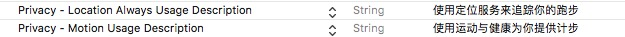
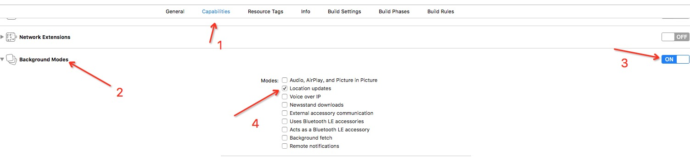
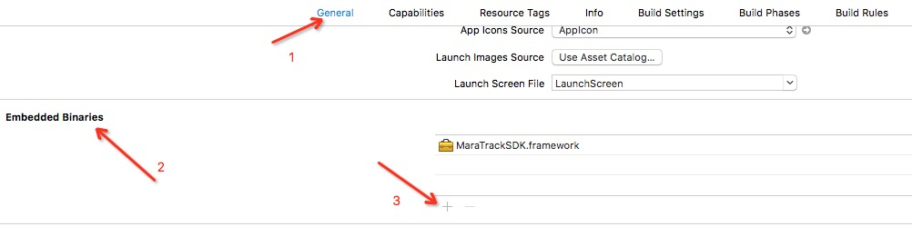
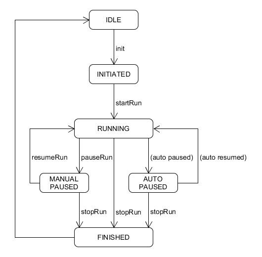

MaraTrackSDK 是基于定位开发的快速集成的跑步功能，包含有定位、自动暂停、恢复跑步、记录跑步数据等功能。
本文档记述马拉马拉跑步引擎（下称引擎或Engine）SDK iOS版本（下称SDK）的介绍和集成指引。

## SDK结构
### 整体结构
#### MaraTrackSDK（单例）
向马拉马拉注册第三方应用
#### MaraTrackManager
对Engine进行生命周期管理和初始化。
#### MaraTrackerConfig
封装了初始化引擎时需要使用的配置项。
#### MaraUserLocation
自定义 location 对象，包含当前点（CLLocation）和当前跑步状态。
#### TrackTask
封装了跑步中的基本数据，包含distance、time、pace等基本信息
#### MaraConstants
`TrackerStatus`和`Environment`枚举常量
	
## SDK集成和使用
#### 必要条件：

- 需要开启定位权限
- 需要开启运动与健身权限

(1)


(2)


### 集成SDK
在项目中引入`MaraTrackSDK`，步骤如图所示：


在使用跑步功能的类中引入框架头文件，初始化`MaraTrackerConfig `，`MaraTrackManager `，代理是可选类型（非跑步页面只用来检测跑步状态时，代理设置为空）

```objective-c
#import <MaraTrackSDK/MaraTrackSDK.h>

MaraTrackerConfig *config = [[MaraTrackerConfig alloc] init];
MaraTrackManager *manager = [[MaraTrackManager alloc] initWith:config delegate:nil];
```
### KEY的保存和认证

>本库的使用者首先需要将自己App的BundleID提供给马拉技术人员，以取得认证用的userKey。通过MaraTrackSDK的registerApp方法，进行身份验证，验证结果通过Block返回。如果在未通过身份验证的情况下进行函数调用，接口返回错误。

### 配置文件
`MaraTrackerConfig`封装引擎初始化和配置需要的一些选项，包括：

* `userId` 用户标识，会记录在最终的跑步详情中
* `lapDistance` 每圈距离，单位米，影响`LapInfo`的计算，默认为1000
* `environment` 跑步类型（室外跑`outdoor`、室内跑`indoor`），参看`MaraConstants.Environment `
* `enableAutoPause`是否开启自动暂停，默认关闭
* `enableDistanceProvision`是否启用步数补充跑步里程，默认开启
* `enableHA`是否启用高可靠机制。启用以后引擎会在存储器保存跑步数据。app意外中断后可以恢复跑步，默认开启
* `enableExceptionalPointFilter`是否开启飘移点过滤，默认开启
如果希望使用自定义配置，重写MaraRunningEngineService基类的下列方法：

### 状态控制
Engine的状态转换如下图所示：


利用上图所示的下列方法对Engine跑步状态进行控制：

```objective-c
/**
 开始跑步
 */
- (void)startRun;

/**
 手动暂停跑步
 */
- (void)pauseRun;

/**
 继续跑步
 */
- (void)resumeRun;

/**
 结束本次跑步
 */
- (void)stopRun;
```

### 状态和数据更新回调
操作引擎、更新数据后:

 1. 相关的状态会在更改后进行回调并且也以1秒时间间隔刷新状态并回调(自动暂停和自动恢复)
 
 ```objective-c
 - (void)maraTrackManager:(MaraTrackManager *)manager didUpdateStatus:(TrackerStatus)status;
 ```

 2. 数据则以1秒的间隔进行回调
 
 ```objective-c
 - (void)maraTrackManager:(MaraTrackManager *)manager didUpdateData:(TrackTask *)task
 ```
 
 3. 定位点有更新立即回调
  
 ```objective-c
 - (void)maraTrackManager:(MaraTrackManager *)manager didUpdateLocation:(MaraUserLocation *)location
 ```
 
 4. 如果开启`MaraTrackerConfig.enableHA`高可靠机制
  
 ```objective-c
 - (void)maraTrackManager:(MaraTrackManager *)manager restoreInterruptData:(NSString *)json
 ```
 
### 数据获取
利用下列接口同步获取跑步相关数据：

```objective-c
/**
 * 获取当前跑步距离
 * @return 距离，单位米
 */
- (double)getDistance;

/**
 * 获取平均配速
 * @return 配速，单位秒
 */
- (double)getAveragePace;

/**
 * 获取当圈配速
 * @return 配速，单位秒
 */
- (double)getLapPace;

/**
 * 获取当前跑步时长
 * @return 时长，单位秒
 */
- (double)getDuration;

/**
 * 获取暂停时长
 * @return 时长，单位秒
 */
- (double)getHaltDuration;

/**
 * 获取当前海拔
 * @return 海拔，单位米
 */
- (double)getAltitude;

/**
 * 获取总爬升
 * @return 爬升，单位米
 */
- (double)getTotalAscend;

/**
 * 获取总下降
 * @return 下降，单位米
 */
- (double)getTotalDescend;

/**
 * 获取当圈爬升
 * @return 爬升，单位米
 */
- (double)getLapAscend;

/**
 * 获取当圈下降
 * @return 下降，单位米
 */
- (double)getLapDescend;

/**
 * 获取平均步频
 * @return 平均步频，单位步/分钟
 */
- (double)getAverageCadence;

/**
 * 获取跑步详细数据，具体格式信息请参考文档
 * @return 跑步详细数据，格式为json
 */
- (NSString *)getRunDetailJson;

/**
 * 获取数据最后一次更新时间
 * @return 时间，为unix时间戳
 */
- (long long)getLastUpdateTime;

/**
 * 获取跑步模式
 * @return 模式，室内 or 路跑
 */
- (Environment)getRunEnvironment;

/**
 * 获取跑步状态
 * @return 状态
 */
- (TrackerStatus)getRunStatus;
```

### 跑步详情结构
从Engine获取的跑步详情，格式为json。
其中大多数字段的用途一目了然，下面数据结构进行介绍。

```json
{
	"altitude_up": 0,                             // 海拔总爬升，单位米
	"altitude_down": 62.200000000000003,          // 海拔总下降，单位米
	"avr_pace": 265.53340766565816,               // 平均配速，单位秒
	"avr_step_freq": 3.0218874997147789,          // 平均步频，单位步/秒
	"avr_step_length": 1.2462424460176627,        // 平均步长，单位米
	"cheat_flag": 0,                              // 是否为可疑数据，1为可疑
	"disabled_duration": 0.060811042785644531,    // GPS信号不可用时间，单位秒
	"distance": 11568.868626381962,               // 跑步距离，单位米
	"duration": 3071.9211091995239,               // 跑步时长，单位秒       
	"halted_duration": 573.08153891563416,        // 暂停时间，单位秒
	"init_time": 1501072208,                      // 引擎初始化时间戳，unix epoc time
	"start_time": 1501104372,                     // 跑步开始时间戳，unix epoc time
	"end_time": 1501108017,                       // 跑步完成时间戳，unix epoc time
	"environment": 1,                             // 跑步类型，1为路跑
	"faint_distance": 0,                          // GPS不可用时用计步补充距离，单位米
	"faint_duration": 0,                          // GPS不可用时间，单位秒
	"lapinfo": {
		"lap_detail": [{
			"asc": 0,                             // 圈总爬升，单位米
			"dec": 37.100000000000001,            // 圈总下降，单位米
			"distance": 1000,                     // 圈距离，单位米
			"duration": 263.18735673677486,       // 圈时长，单位秒
			"endpoint": {                         // 圈完结点，经纬度
				"latitude": 39.866745062934029,
				"longitude": 116.50043294270833
			},
			"lap_no": 1,                          // 圈编号
			"pace": 263.18735673677486,           // 圈配速，单位秒
			"start_time": 1501104372.9105909,     // 圈开始时间戳，unix epoc time
			"step_freq": 2.8230839399443743,      // 圈平均步频，单位步/秒
			"step_length": 1.3458950201884252,    // 圈平均步长，单位米
			"step_num": 743                       // 圈总步数
		},
		...,
		"lap_num": 12                             // 总圈数，包括不足一圈距离的最后一圈
	},
	"max_pace": 256.68859662604513,               // 最快配速，单位秒/每圈距离
	"min_pace": 275.99028879037826,               // 最慢配速，单位秒/每圈距离
	"max_altitude": 58.200000000000003,           // 最高海拔，单位米
	"min_altitude": 2.2000000000000002,           // 最低海拔，单位米
	"max_step_freq": 3.2333333333333334,          // 单位时间（1分钟）最大步频，单位步/秒
	"max_step_length": 2.789730014175178,         // 单位时间（1分钟）最大步长，单位米
	"min_step_freq": 0,                           // 单位时间（1分钟）最小步频，单位步/秒
	"min_step_length": 0,                         // 单位时间（1分钟）最小步长，单位米
	"step_info": [{                               // 一个计步单位时间内数据
		"distance": 217.39579980598864,           // 距离，单位米
		"duration": 60,                           // 时长，单位秒
		"seq_no": 0,                              // 数据编号
		"step": 123                               // 总步数
	},
	...
```
	
